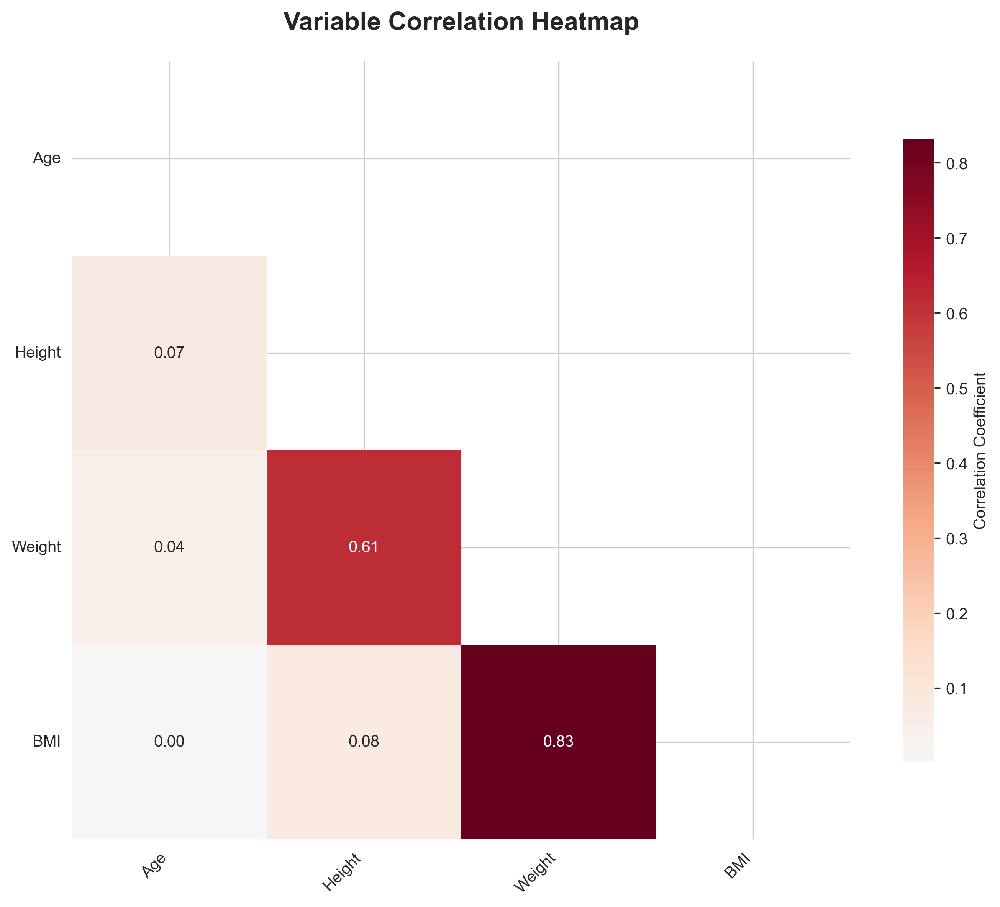

# NIPT Exploratory Data Analysis Report (Optimized)

**Generated on:** 2025-09-04 19:29:23

## 1. Data Overview

| Metric | Value |
|--------|-------|
| Total Records | 1,070 |
| Total Fields | 31 |
| Missing Values | 1,070 |
| Data Completeness | 96.8% |

## 2. Variable Summary

### Numeric Variables (24)
序号, Age, Height, Weight, 检测抽血次数, 检测孕周, BMI, 原始读段数, 在参考基因组上比对的比例, 重复读段的比例...

### Categorical Variables (5)
孕妇代码, IVF_Pregnancy, Chromosome_Aneuploidy, Pregnancy_Count, Fetal_Health

## 3. Key Findings

### Strong Correlations (|r| > 0.7)
- **Weight ↔ BMI**: 0.832

### Statistical Test Results

#### Normality Tests

- **序号**: p-value=0.0000 (Non-normal)
- **Age**: p-value=0.0000 (Non-normal)
- **Height**: p-value=0.0000 (Non-normal)
- **Weight**: p-value=0.0000 (Non-normal)
- **检测抽血次数**: p-value=0.0000 (Non-normal)
- **BMI**: p-value=0.0000 (Non-normal)
- **原始读段数**: p-value=0.0000 (Non-normal)
- **在参考基因组上比对的比例**: p-value=0.0000 (Non-normal)
- **重复读段的比例**: p-value=0.0000 (Non-normal)
- **唯一比对的读段数  **: p-value=0.0000 (Non-normal)
- **GC含量**: p-value=0.0000 (Non-normal)
- **13号染色体的Z值**: p-value=0.0000 (Non-normal)
- **18号染色体的Z值**: p-value=0.0000 (Non-normal)
- **21号染色体的Z值**: p-value=0.3921 (Normal)
- **X染色体的Z值**: p-value=0.0000 (Non-normal)
- **Y染色体的Z值**: p-value=0.0000 (Non-normal)
- **Y染色体浓度**: p-value=0.0000 (Non-normal)
- **X染色体浓度**: p-value=0.0000 (Non-normal)
- **13号染色体的GC含量**: p-value=0.0000 (Non-normal)
- **18号染色体的GC含量**: p-value=0.0000 (Non-normal)
- **21号染色体的GC含量**: p-value=0.0000 (Non-normal)
- **被过滤掉读段数的比例**: p-value=0.0000 (Non-normal)
- **生产次数**: p-value=0.0000 (Non-normal)

#### Independence Tests

- **IVF_Pregnancy vs Fetal_Health**: p-value=0.0000 (Related)

## 4. Visualizations

### 4.1 Numeric Variable Distributions

### 4.2 Variable Correlations

### 4.3 Categorical Variable Distributions

### 4.4 Variable Relationships

### 4.5 Group Comparisons

## 5. Recommendations

### Data Quality
- Dataset shows good overall quality with 96.8% completeness
- Continue monitoring data collection processes

### Further Analysis
- Investigate strong correlations for potential causal relationships
- Consider non-parametric tests for non-normal distributions
- Explore interaction effects between variables
- Develop predictive models based on identified patterns

### Technical Notes
- All visualizations use English labels to avoid encoding issues
- Charts are optimized for better layout and readability
- Interactive versions available in HTML format

---

**Report generated by NIPT Exploratory Data Analysis Tool (Optimized Version)**
