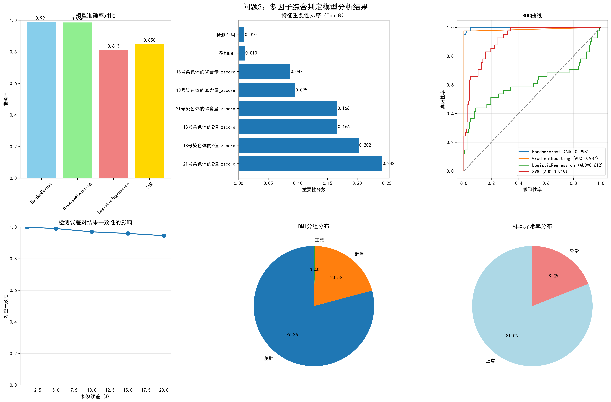

# 问题3：多因子综合判定模型分析报告

## 1. 数据概况

- 总记录数：1070
- 特征数：11
- 异常样本数：203
- 异常比例：18.97%

## 2. 模型性能对比

| 模型 | 准确率 | 精确率 | 召回率 | F1分数 | AUC |
|------|--------|--------|--------|--------|-----|
| RandomForest | 0.9907 | 0.9908 | 0.9907 | 0.9906 | 0.9984 |
| GradientBoosting | 0.9860 | 0.9862 | 0.9860 | 0.9858 | 0.9868 |
| LogisticRegression | 0.8131 | 0.8482 | 0.8131 | 0.7338 | 0.6124 |
| SVM | 0.8505 | 0.8376 | 0.8505 | 0.8275 | 0.9192 |

## 3. 交叉验证结果

- RandomForest: 0.9916 ± 0.0062
- GradientBoosting: 0.9935 ± 0.0023
- LogisticRegression: 0.8176 ± 0.0059
- SVM: 0.8859 ± 0.0260

## 4. 特征重要性分析

基于随机森林模型的特征重要性排序：

- 21号染色体的Z值_zscore: 0.2420
- 18号染色体的Z值_zscore: 0.2025
- 13号染色体的Z值_zscore: 0.1664
- 21号染色体的GC含量_zscore: 0.1659
- 13号染色体的GC含量_zscore: 0.0949
- 18号染色体的GC含量_zscore: 0.0868
- 孕妇BMI: 0.0103
- 检测孕周: 0.0095
- 体重: 0.0085
- 年龄: 0.0070

## 5. 检测误差影响分析

| 误差水平 | 标签一致性 | 假阳性率 | 假阴性率 |
|----------|------------|----------|----------|
| 1% | 1.0000 | 0.0000 | 0.0000 |
| 5% | 0.9907 | 0.0047 | 0.0047 |
| 10% | 0.9701 | 0.0103 | 0.0196 |
| 15% | 0.9598 | 0.0159 | 0.0243 |
| 20% | 0.9458 | 0.0243 | 0.0299 |

## 6. 蒙特卡洛敏感性模拟结果

| 误差水平 | 一致性(均值) | 95%CI | 假阳性率(均值) | 95%CI | 假阴性率(均值) | 95%CI |
|----------|--------------|-------|----------------|-------|----------------|-------|
| 1% | 0.9982 | [0.9963, 1.0000] | 0.0004 | [0.0000, 0.0019] | 0.0015 | [0.0000, 0.0028] |
| 5% | 0.9884 | [0.9822, 0.9935] | 0.0053 | [0.0019, 0.0093] | 0.0063 | [0.0019, 0.0103] |
| 10% | 0.9753 | [0.9673, 0.9832] | 0.0105 | [0.0056, 0.0159] | 0.0142 | [0.0084, 0.0206] |
| 15% | 0.9613 | [0.9505, 0.9701] | 0.0172 | [0.0103, 0.0243] | 0.0215 | [0.0150, 0.0280] |
| 20% | 0.9476 | [0.9364, 0.9570] | 0.0241 | [0.0168, 0.0318] | 0.0283 | [0.0205, 0.0355] |

## 7. 统计性检验结果

- t检验(BMI 正常 vs 肥胖)：t=1.253957243735212, p=0.29737199774374423, n1=4, n2=847, 指标=13号染色体的Z值_zscore
- 单因素ANOVA(BMI分组)：F=0.5504907967664281, p=0.5768304053030284, 组数=3, 指标=13号染色体的Z值_zscore
- Yates校正卡方(BMI二分类×异常)：chi2=0.1093984035546106, p=0.7408300869004316, df=1

## 8. 结论与建议

### 主要结论

1. **最佳模型**: RandomForest，准确率达到0.9907
2. **多因子模型**: 综合考虑孕周、BMI、年龄等因素能有效提高判定准确性
3. **检测误差影响**: 随着检测误差增加，模型一致性下降
4. **关键特征**: 21号染色体的Z值_zscore对判定结果影响最大

### 临床应用建议

1. **模型选择**: 推荐使用随机森林模型进行综合判定
2. **质量控制**: 严格控制检测误差在5%以内
3. **个性化检测**: 根据BMI等因素制定个性化检测策略
4. **持续优化**: 随着数据积累持续优化模型参数

## 9. 图表汇总

### 综合可视化面板

### 蒙特卡洛敏感性分析

### 统计性检验图

### 肥胖组对比：期望风险曲线

### 超重组对比：期望风险曲线

---

**报告生成时间**: 2025年09月06日 20:53:58
**分析工具**: Python机器学习
**数据来源**: d:\Program code\pythonproject\mathmodel\(MAN)final_cleaned_data.xlsx